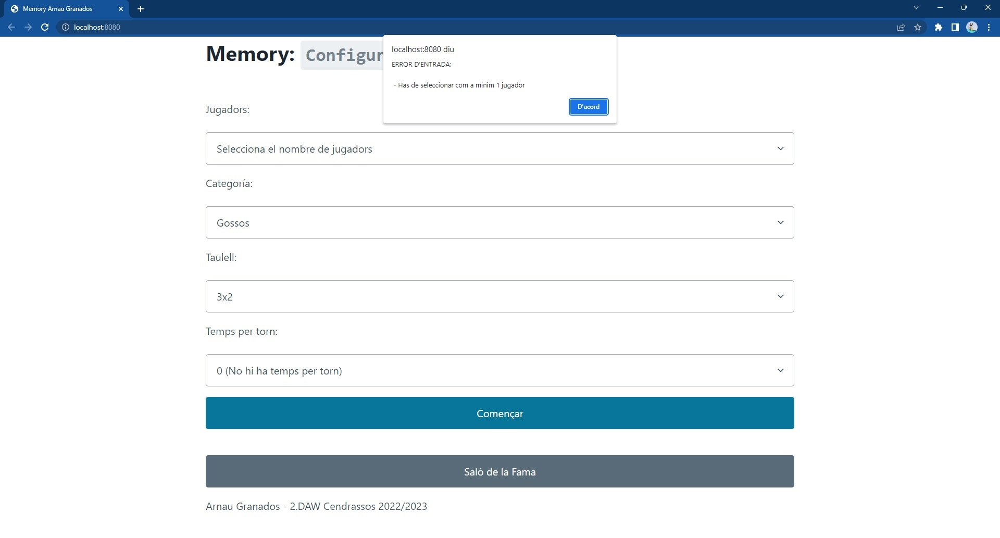
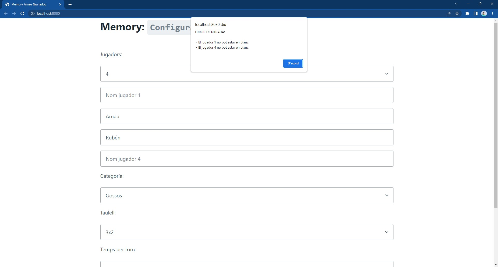
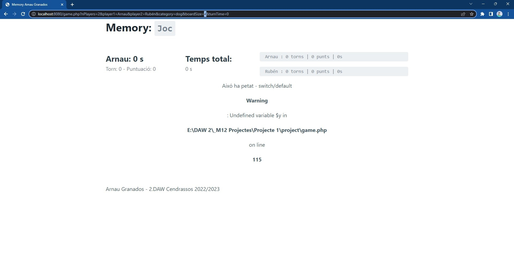
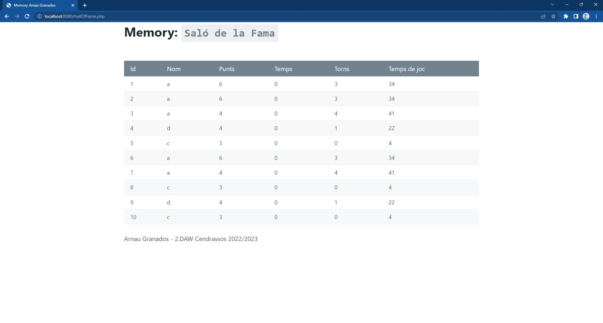
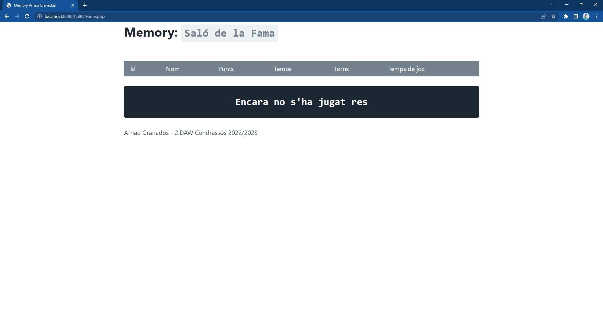

# Inicialice
In order to execute the game, you need to:
- Have [JavaScript enabled](https://support.google.com/adsense/answer/12654?hl=en) on your browser 
- Have installed [PHP8](https://www.php.net/downloads) or newer
- Open terminal in the "project" folder and write `php -S localhost:8080`
- Go to [localhost:8080](http://localhost:8080/) on your browser.

# Score board data
At the end of the game, a cookie is created with the game stats to create a score board, saves "unlimited" scores but shows only the first 10.

***

# Planning

1. I've started by creating the home page statically, followed by the Hall of Fame and the game "board".

2. I created the form validation, the preparation of the listed players and the card system.

3. With Pico CSS I changed the default HTML style to a modern and minimalist one.

4. I created the game mechanics.

5. I applied the mechanics of turns, expired moves and lost moves of each player.

6. I applied the timer, take into account the start of the turn, when you score, do not complete moves in the turn, miss or do not participate.

7. I fixed all the problems that point 6 caused me.

8. I created the cookie for the winner with all game stats showing the first 10 players.

9. I had to change my board building system to php, now it does the same. But with php.

# Requirements

The program must be run on a web server, supported by php software, it is a memory game, where it asks for data through a form to adapt the game to the player's demand, and once finished the game, pick up the status of the actual player and add it tho the cookie data to be displayed in the hall of fame.

Needs a modern browser to be able to execute PHP8+ and JSES6 (no IE6...).

# Functional tests

 Test #1 : Unselected Amount of players.

 Test #2 : Some players missing the name.

> `Due to the structure of the form, all the other fields have fixed values, and their modification in the link of the game.php tab can give visible errors and prevent the correct development of the game`
> Test #3 : Example of trying to modify the boardSize value in the `game.php` link.

 Test #4 : Hall of fame of top ten scores.

 Test #4 : Hall of fame of top ten scores.
